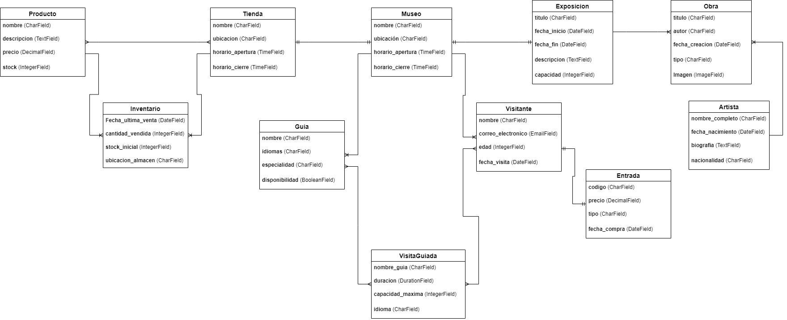

# Aplicacion-Web--Museo
Aplicación Web sobre un museo que se ira desarrollando a lo largo del curso.

Para este proyecto, he elegido una página web de un museo. En esta página, podremos ver información relevante del museo, como sus exposiciones, las obras que están expuestas en él, junto con información sobre sus respectivos autores. También cuenta con guías que se encargarán de realizar diferentes visitas guiadas a los clientes del museo. Por último, también incluye una tienda donde se podrán comprar distintos productos relacionados con el museo o con sus exposiciones.

Modelos de Museo:

Modelo: Museo
nombre (CharField): Nombre del museo
ubicacion (CharField): Dirección del museo
horario_apertura (TimeField): Horario en el que abre el museo
horario_cierre (TimeField): Horario en el que cierra el museo

Modelo: Exposicion
titulo (CharField): Título de la exposición
fecha_inicio (DateField): Fecha de inicio de la exposición
fecha_fin (DateField): Fecha de finalización de la exposición
descripcion (TextField): Detalles de la exposición
capacidad (IntegerField): Cantidad total de personas que pueden asistir

Relación OneToOne con Museo: El museo solo realiza una exposición a la vez.

Modelo: Obra
titulo (CharField): Título de la obra
autor (CharField): Nombre del autor de la obra
fecha_creacion (DateField): Fecha en la que se creó la obra
tipo (CharField): Tipo de obra (escultura, pintura, etc.)
Imagen (ImageField): Foto de la obra

Relación ManyToOne con Exposicion: Una exposición cuenta con varias obras, pero las obras solo pueden estar en una exposición a la vez.

Modelo: Artista
nombre_completo (CharField): Nombre completo del artista
fecha_nacimiento (DateField): Fecha de nacimiento del artista
biografia (TextField): Información sobre el artista
nacionalidad (CharField): Nacionalidad del artista

Relación ManyToOne con Obra: Un artista puede tener varias obras en el museo.

Modelo: Visitante
nombre (CharField): Nombre del visitante
correo_electronico (EmailField): Correo electrónico del visitante
edad (IntegerField): Edad del visitante
fecha_visita (DateField): Fecha de la visita al museo

Relación ManyToOne con Museo: Un museo puede tener varios visitantes, pero un visitante solo puede estar en un museo a la vez.

Modelo: Entrada
codigo (CharField): Código único de la entrada
precio (DecimalField): Precio de la entrada
tipo (CharField): Tipo de entrada (adulto, niño, etc.)
fecha_compra (DateField): Fecha en la que se compró la entrada

Relación OneToOne con Visitante: Cada entrada es comprada por un único visitante

Modelo: Tienda
nombre (CharField): Nombre de la tienda del museo
ubicacion (CharField): Ubicación de la tienda dentro del museo
horario_apertura (TimeField): Hora de apertura de la tienda
horario_cierre (TimeField): Hora de cierre de la tienda

Relación OneToOne con Museo: Cada museo sólo tiene una tienda específica

Modelo: Producto
nombre (CharField): Nombre del producto
descripcion (TextField): Descripción del producto
precio (DecimalField): Precio del producto
stock (IntegerField): Cantidad disponible en la tienda

Relación ManyToMany con Tienda (con tabla intermedia): Varios productos pueden estar en una o varias tiendas.

Modelo: Inventario
cantidad_vendida (IntegerField): Cantidad del producto vendida.
fecha_ultima_venta (DateField): Fecha de la última venta.
stock_inicial (IntegerField): Cantidad inicial del producto en el inventario.
ubicacion_almacen (CharField): Ubicación en el almacén donde se encuentra el producto.

Relación: Inventario será una tabla intermedia entre Tienda y Producto, ya que relaciona la cantidad de productos vendidos en la tienda y otros detalles. Tendrá una relación ManyToOne con Producto y otra ManyToOne con Tienda.

Modelo: Guia
nombre (CharField): Nombre del guía
idiomas (CharField): Idiomas que habla
especialidad (CharField): Que tipo de arte ha estudiado
disponibilidad (BooleanField): Indica si está disponible para una visita guiada

Relación ManyToOne con Museo: Varios guías trabajan en un museo específico

Modelo: Visita guiada
duracion (DurationField): Duracion de la visita
nombre_guia (CharField):  Nombre del guia que la imparte
capacidad_maxima (IntegerField): Número máximo de visitantes que pueden unirse a la visita guiada.
idioma (CharField): Idioma en el que se realiza la visita (por ejemplo, español, inglés).

Relación ManyToMany con Visitante: Varios visitantes pueden asistir a varias visitas guiadas.

Relaciones Resumidas:

OneToOne:
Tienda ↔ Museo 
Visitante ↔ Entrada
Exposición ↔ Museo 
ManyToOne:
Visitante →  Museo
Obra → Exposición 
Obra → Artista
Guia →  Museo
ManyToMany:
Guia ↔  Visita_guiada 
Visitante ↔ Visita_guiada 
Tienda ↔ Producto (con tabla intermedia) 

